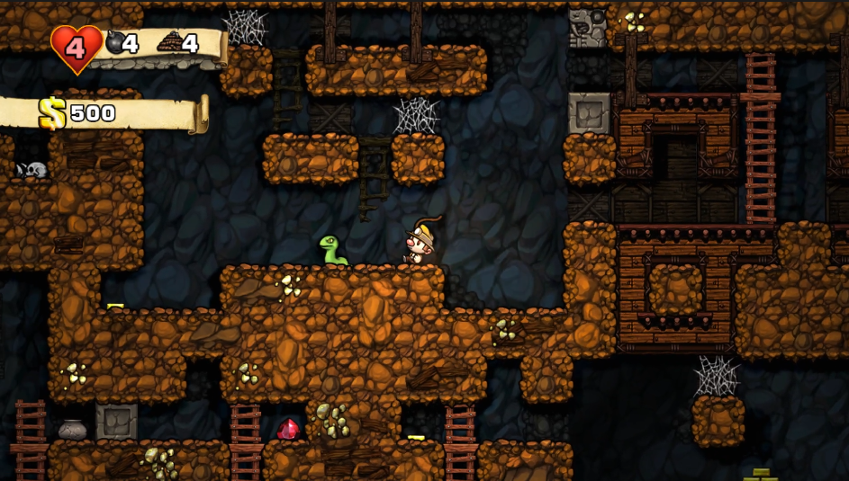

<!-- GENERAL GAME INFO -->
 

  <h1 align="center">Spelunky</h1>

  

    Spelunky is a cave exploration / treasure-hunting game inspired by classic platform games and roguelikes, where the goal is to grab as much treasure from the cave as possible. Every time you play the cave's layout will be different. Use your wits, your reflexes, and the items available to you to survive and go ever deeper! Perhaps at the end you may find what you're looking for...
     
    <strong>Original game : </strong>
    <a href="https://store.steampowered.com/app/239350/Spelunky/"><strong>General info »</strong></a>
    ·
    <a href="https://youtu.be/N1uiLR6luWo"><strong>Youtube video »<strong></a>
     
     
  

<!-- TABLE OF CONTENTS -->

  
Table of Contents

  <ol>
    <li>
      <a href="#about-the-project">About The Project</a>
    </li>
    <li>
      <a href="#my-version">My version</a>
    </li>
    <li>
      <a href="#getting-started">Getting Started</a>
    </li>
    <li><a href="#how-to-play">How To Play</a></li>
    <li><a href="#class-structure">Class structure</a></li>
    <li><a href="#checklist">Checklist</a></li>
    <li><a href="#contact">Contact</a></li>
    <li><a href="#acknowledgments">Acknowledgments</a></li>
  </ol>

<!-- ABOUT THE PROJECT -->
## About The Project

Here's why:
* The interaction between you the enemies and the environment are virtual limitless
* because of the randomly generated levels you can always replay it.
* Dynamic physics with destroyable environments. 

(<a href="#readme-top">back to top</a>)

## My version

This section gives a clear and detailed overview of which parts of the original game I planned to make.

### The minimum I will most certainly develop:
- [ ] Level generation
	- [x] 4x4 rooms
	- [x] 100% goal path (step 1 of book)
	- [ ] Individual rooms (step 2 of book)
	- [ ] Obstacles in rooms (step 3 of book)
	- [ ] Items and enemy placement
- [ ] World
	- [ ] All "objects" need to have physics.
	- [ ] All "items/monsters" need to be able to be picked up.
	- [ ] All "items/monsters" need to be able to be thrown.
	- [ ] Spiderwebs (slow down any object)
	- [ ] Pots
	- [ ] Level destruction.
	- [ ] Arrow traps.
	- [ ] Spikes (If landed on instant death. Can be walked through)
	- [ ] Exit door
	- [ ] Light system
	- [ ] Tiles that can snap together.
- [ ] Physics:
	- [ ] Gravity, velocity, acceleration
	- [ ] Impact damage
	- [ ] Destroyed item if impact too large.
	- [ ] Objects need to rotate when in air.
	- [ ] Collision.
	- [ ] Reaction on collision.
	- [ ] If object hit with enough impact it will get stunned.
- [ ] Player
	- [ ] Animated spritesheet
	- [ ] Jumping
	- [ ] Moving left right
	- [ ] Failing
	- [ ] Fall damage
	- [ ] Sprinting
	- [ ] Crouching
	- [ ] Crouch walking
	- [ ] Hanging off ledges 
	- [ ] Pickup objects / holding objects.
	- [ ] Throw object.
	- [ ] Put object back on floor.
	- [ ] Whip (Can damage Objects)
	- [ ] Jump on top of monsters.
	- [ ] Ropes that can be thrown up.
	- [ ] Climbing on ropes and ladders. 
	- [ ] Bombs.
	- [ ] Player invisible frames if gets hit.
- [ ] UI
	- [ ] Money counter
	- [ ] Health, bombs, rope.
	- [ ] Death screen
- [ ] Particles
	- [ ] Blood particles when something gets hit.
	- [ ] Explosion
- [ ] Monsters:
	- [ ] AI system thats used by all monsters.
	- [ ] Damsel (Can be picked up and will run around if not picked up). 
	- [ ] Snake (Moves left and right if found edge or wall)
	- [ ] Bat (When its above the player and close enough it will fly towards the player)
	- [ ] Some monsters damages the player if get hit.

### What I will probably make as well:
- [ ] UI
	- [ ] Start up animation (The walls are shifting)
	- [ ] Level text.
	- [ ] Money gets added animation
- [ ] Player
	- [ ] Rope moving past effect.
- [ ] Particles
	- [ ] Player lands smoke.
	- [ ] Skeleton head/pot breaks.
	- [ ] Gold pickup particles

### What I plan to create if I have enough time left:
- [ ] World
	- [ ] Light system
	- [ ] Shop
	- [ ] Stealable totem with bolder.
	- [ ] Sacrifice altar.
- [ ] Items:
	- [ ] Shotgun
	- [ ] Jetpack
	- [ ] Jump boots
	- [ ] Grab ledge hand
- [ ] Monsters:
	- [ ] Shop keeper (Will shoot the player if he steals something or his shop breaks).
	- [ ] Small spider (Drops down onto the player)
- [ ] Extra
	- [ ] Web browser support

(<a href="#readme-top">back to top</a>)

<!-- GETTING STARTED -->
## Getting Started
Detailed instructions on how to run your game project are in this section.

### Prerequisites

This is an example of how to list things you need to use the software and how to install them.
* Visual Studio 2022

### How to run the project

Explain which project (version) must be run.
* any extra steps if required 

(<a href="#readme-top">back to top</a>)

<!-- HOW TO PLAY -->
## How to play

Use this space to show useful examples of how a game can be played. 
Additional screenshots and demos work well in this space. 

### Controls
* keys, .. 
* .. 

(<a href="#readme-top">back to top</a>)

<!-- CLASS STRUCTURE -->
## Class structure 

### Object composition 
If you applied object composition (optional); explain where and how.

### Inheritance 
Explain where you applied inheritance (mandatory).

### ..

(<a href="#readme-top">back to top</a>)

<!-- CHECKLIST -->
## Checklist

- [x] Accept / set up github project
- [ ] week 01 topics applied
    - [ ] const keyword applied proactively (variables, functions,..)
    - [ ] static keyword applied proactively (class variables, static functions,..)
    - [ ] object composition (optional)
- [ ] week 02 topics applied
- [ ] week 03 topics applied
- [ ] week 04 topics applied
- [ ] week 05 topics applied
- [ ] week 06 topics applied
- [ ] week 07 topics applied
- [ ] week 08 topics applied
- [ ] week 09 topics applied (optional)
- [ ] week 10 topics applied (optional)

(<a href="#readme-top">back to top</a>)

<!-- CONTACT -->
## Contact

Arthur van den Barselaar - arthur.van.den.barselaar@student.howest.be

Project Link: [https://github.com/HowestDAE/dae16-ArthurvandenBarselaar](https://github.com/HowestDAE/dae16-ArthurvandenBarselaar)

(<a href="#readme-top">back to top</a>)

<!-- ACKNOWLEDGMENTS -->
## Acknowledgments

Use this space to list resources you find helpful and would like to give credit to. 

* [Example 1: cpp reference on std::vector](https://en.cppreference.com/w/cpp/container/vector)
* [Spelunky by Derek Yu (book)](https://bossfightbooks.com/products/spelunky-by-derek-yu)

(<a href="#readme-top">back to top</a>)

