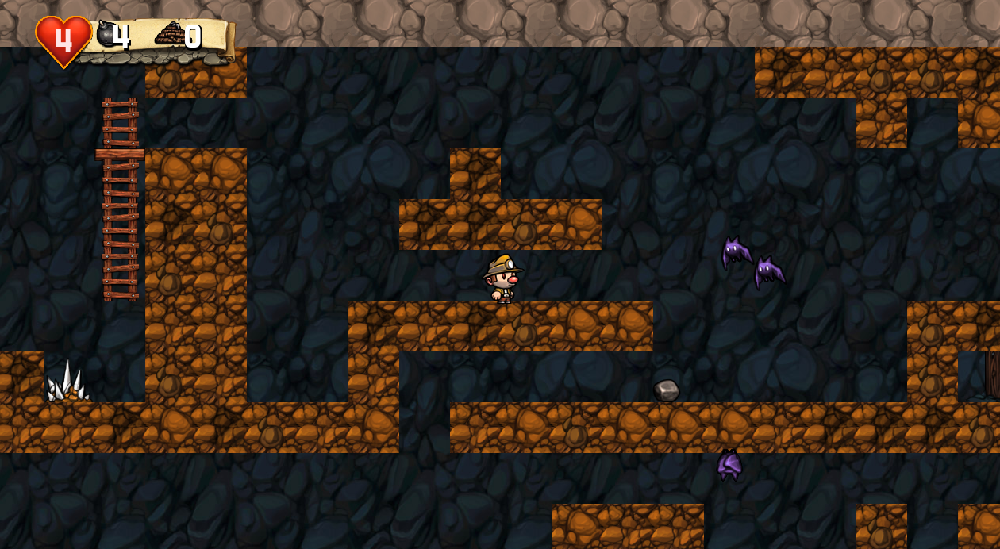

<div name="readme-top"></div>

<!-- GENERAL GAME INFO -->
<br />
<div align="center">

  <h1 align="center">Spelunky</h1>

  <p align="center">
    Spelunky is a cave exploration / treasure-hunting game inspired by classic platform games and roguelikes, where the goal is to grab as much treasure from the cave as possible. Every time you play the cave's layout will be different. Use your wits, your reflexes, and the items available to you to survive and go ever deeper! Perhaps at the end you may find what you're looking for...
    <br />
    <strong>Original game : </strong>
    <a href="https://store.steampowered.com/app/239350/Spelunky/"><strong>Steam Store »</strong></a>
    ·
    <a href="https://youtu.be/N1uiLR6luWo"><strong>Youtube video »<strong></a>
    <br />
    <br />
  </p>
</div>


<!-- TABLE OF CONTENTS -->
<details>
  <summary>Table of Contents</summary>
  <ol>
    <li>
      <a href="#about-the-project">About The Project</a>
    </li>
    <li>
      <a href="#my-version">My version</a>
    </li>
    <li>
      <a href="#getting-started">Getting Started</a>
    </li>
    <li><a href="#how-to-play">How To Play</a></li>
    <li><a href="#class-structure">Class structure</a></li>
    <li><a href="#checklist">Checklist</a></li>
    <li><a href="#contact">Contact</a></li>
    <li><a href="#acknowledgments">Acknowledgments</a></li>
  </ol>
</details>


<!-- ABOUT THE PROJECT -->
## About The Project


Here's why:
* The interaction between you the enemies and the environment are virtual limitless
* because of the randomly generated levels you can always replay it.
* Dynamic physics with destroyable environments. 


<p align="right">(<a href="#readme-top">back to top</a>)</p>


## My version

This section gives a clear and detailed overview of which parts of the original game I planned to make.

### The minimum I will most certainly develop:
- [x] Level generation
	- [x] 4x4 rooms
	- [x] 100% goal path (step 1 of book)
	- [x] Individual rooms (step 2 of book)
	- [x] Obstacles in rooms (step 3 of book)
	- [x] Items and enemy placement
- [ ] World
	- [x] All "objects" need to have physics.
	- [x] All "items/monsters" need to be able to be picked up.
	- [x] All "items/monsters" need to be able to be thrown.
	- [ ] Spiderwebs (slow down any object)
	- [ ] Pots
	- [x] Level destruction.
	- [ ] Arrow traps.
	- [x] Spikes (If landed on instant death. Can be walked through)
	- [x] Exit door
	- [ ] Tiles that can snap together.
- [ ] Physics:
	- [x] Gravity, velocity, acceleration
	- [x] Impact damage
	- [x] Destroyed item if impact too large.
	- [ ] Objects need to rotate when in air.
	- [x] Collision.
	- [x] Reaction on collision.
	- [x] If object hit with enough impact it will get stunned.
- [ ] Player
	- [x] Animated spritesheet
	- [x] Jumping
	- [x] Moving left right
	- [x] Failing
	- [ ] Fall damage
	- [x] Sprinting
	- [x] Crouching
	- [x] Crouch walking
	- [x] Hanging off ledges 
	- [x] Pickup objects / holding objects.
	- [x] Throw object.
	- [x] Put object back on floor.
	- [x] Whip (Can damage Objects)
	- [ ] Jump on top of monsters.
	- [ ] Ropes that can be thrown up.
	- [x] Climbing on ropes and ladders. 
	- [x] Bombs.
	- [x] Player invisible frames if gets hit.
- [ ] UI
	- [ ] Money counter
	- [x] Health, bombs, rope.
	- [ ] Death screen
- [ ] Particles
	- [ ] Blood particles when something gets hit.
	- [ ] Explosion
- [X] Monsters:
	- [x] AI system thats used by all monsters.
	- [X] Damsel (Can be picked up and will run around if not picked up). 
	- [x] Snake (Moves left and right if found edge or wall)
	- [x] Bat (When its above the player and close enough it will fly towards the player)
	- [x] Some monsters damages the player if get hit.

### What I will probably make as well:
- [ ] UI
	- [ ] Start up animation (The walls are shifting)
	- [ ] Level text.
	- [ ] Money gets added animation
- [ ] Player
	- [ ] Rope moving past effect.
- [ ] Particles
	- [ ] Player lands smoke.
	- [ ] Skeleton head/pot breaks.
	- [ ] Gold pickup particles


### What I plan to create if I have enough time left:
- [ ] World
	- [ ] Light system
	- [ ] Shop
	- [ ] Stealable totem with bolder.
	- [ ] Sacrifice altar.
- [ ] Items:
	- [ ] Shotgun
	- [ ] Jetpack
	- [ ] Jump boots
	- [ ] Grab ledge hand
- [ ] Monsters:
	- [ ] Shop keeper (Will shoot the player if he steals something or his shop breaks).
	- [ ] Small spider (Drops down onto the player)
- [ ] Extra
	- [ ] Web browser support


<p align="right">(<a href="#readme-top">back to top</a>)</p>


<!-- GETTING STARTED -->
## Getting Started

### Prerequisites

* Visual Studio 2022

### How to run the project

Launch the Prog2Engine.sln in visual studio and build debug 64x.

<p align="right">(<a href="#readme-top">back to top</a>)</p>


<!-- HOW TO PLAY -->
## How to play


### Controls
* ArrowKeys: move character
* Shift: Sprint
* Z: Jump
* X: Use whip
* A: Throw bomb
* Down arrow: crouch
* Crouch + X: Pickup item.
* Holding item + X: Throw item
* Q+W+E+R+T+Y: Use your mouse to move the camera

You can pick up rocks and the dog

<p align="right">(<a href="#readme-top">back to top</a>)</p>


<!-- CLASS STRUCTURE -->
## Class structure

### Object composition 
`Entity.h` uses composition with `RectPhysicsCollider.h`. Every entity has a rect physics collider.
`Tile.h` Also uses composition with the `RectPhysicsCollider.h`


### Inheritance 
Every entity inheritits from `Entity.h` This makes it so that every entity has a collider to collider against. 
Derived classes will overwrite `GetEntityType()` To tell other classes what type of entity it is.

Types are
```
player
rock
bomb
snake
bat
damsel
```


<p align="right">(<a href="#readme-top">back to top</a>)</p>


<!-- CHECKLIST -->
## Checklist

- [x] Accept / set up github project
- [x] week 01 topics applied
    - [x] const keyword applied proactively (variables, functions,..)
    - [x] static keyword applied proactively (class variables, static functions,..)
    - [x] object composition (optional)
- [x] week 02 topics applied
- [x] week 03 topics applied
- [x] week 04 topics applied
- [x] week 05 topics applied
- [x] week 06 topics applied
- [x] week 07 topics applied
- [x] week 08 topics applied
- [ ] week 09 topics applied (optional)
- [x] week 10 topics applied (optional)


<p align="right">(<a href="#readme-top">back to top</a>)</p>

<!-- CONTACT -->
## Contact

Arthur van den Barselaar - arthur.van.den.barselaar@student.howest.be

Project Link: [https://github.com/HowestDAE/dae16-ArthurvandenBarselaar](https://github.com/HowestDAE/dae16-ArthurvandenBarselaar)

<p align="right">(<a href="#readme-top">back to top</a>)</p>


<!-- ACKNOWLEDGMENTS -->
## Acknowledgments
* [Spelunky by Derek Yu (book)](https://bossfightbooks.com/products/spelunky-by-derek-yu)
* [One Lone Coder Rect vs Rect Collision](https://github.com/OneLoneCoder/Javidx9/blob/master/PixelGameEngine/SmallerProjects/OneLoneCoder_PGE_Rectangles.cpp)

<p align="right">(<a href="#readme-top">back to top</a>)</p>

